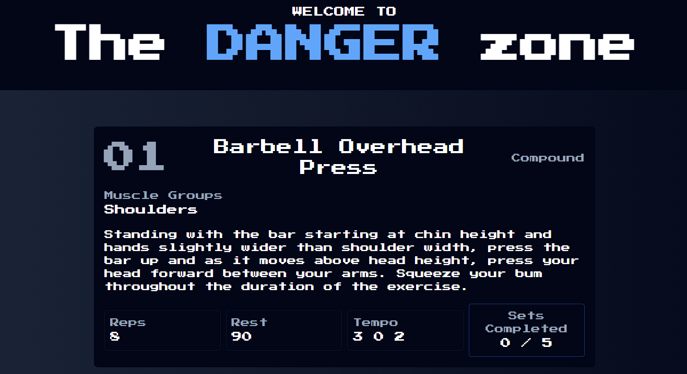

# Shredded

A personalized workout generator creating tailored exercise routines based on your goals and target muscles.

 

## 🏋️‍♂️ About

Shredded is a React-based fitness application that generates customized workout routines based on your specific goals and target muscle groups. No more guesswork - just select your preferences and get a professionally designed workout ready to crush.

## ✨ Features

- **Personalized Workouts**: Generate workouts tailored to your specific goals
- **Multiple Workout Types**: Choose from individual, push/pull, upper/lower, and full body routines
- **Goal-based Training**: Select from hypertrophy, strength, or endurance-focused workouts
- **Muscle Targeting**: Specifically target up to two muscle groups for focused training
- **Exercise Details**: Get comprehensive information for each exercise including proper form guidance
- **Set Tracking**: Track completed sets during your workout

## 🚀 Getting Started

### Prerequisites

- Node.js (v14.0.0 or higher)
- npm or yarn

### Installation

1. Clone the repository
```bash
git clone https://github.com/yourusername/shredded.git
cd shredded
```

2. Install dependencies
```bash
npm install
# or
yarn install
```

3. Start the development server
```bash
npm start
# or
yarn start
```

4. Open your browser and navigate to `http://localhost:3000`

## 🔧 Usage

1. **Pick Your Poison**: Select your preferred workout type (Individual, Push/Pull, Upper/Lower, Full Body)
2. **Lock on Targets**: Choose up to two muscle groups to focus on
3. **Set Your Goal**: Select your training objective (Hypertrophy, Strength, Endurance)
4. **Generate**: Click "Formulate" to create your personalized workout
5. **Track Progress**: Mark sets as completed as you work through the routine

## 🧩 Project Structure

```
/src
  /components
    Button.jsx            # Reusable button component
    ExerciseCard.jsx      # Card displaying exercise details
    Generator.jsx         # Workout generator interface
    Hero.jsx              # Landing page hero section
    SectionWrapper.jsx    # Layout wrapper for sections
    Workout.jsx           # Workout display component
  /utils
    functions.js          # Core workout generation logic
    shredder.js           # Exercise database and workout schemes
```

## 🔄 Workout Generation Logic

The app uses a sophisticated algorithm to:
- Filter exercises by target muscles and workout type
- Balance compound and accessory movements based on your goals
- Apply appropriate rep ranges, rest periods, and tempos
- Ensure adequate muscle recovery between similar movement patterns

## 🛠️ Technologies Used

- React.js
- Tailwind CSS
- JavaScript ES6+

## 🤝 Contributing

Contributions are welcome! Please feel free to submit a Pull Request.

1. Fork the project
2. Create your feature branch (`git checkout -b feature/AmazingFeature`)
3. Commit your changes (`git commit -m 'Add some AmazingFeature'`)
4. Push to the branch (`git push origin feature/AmazingFeature`)
5. Open a Pull Request

## 📝 License

This project is licensed under the MIT License - see the LICENSE file for details.

## 🙏 Acknowledgements

- All the fitness enthusiasts who tested early versions
- The React and Tailwind CSS communities for their excellent tools
- Everyone who contributed to the exercise database
